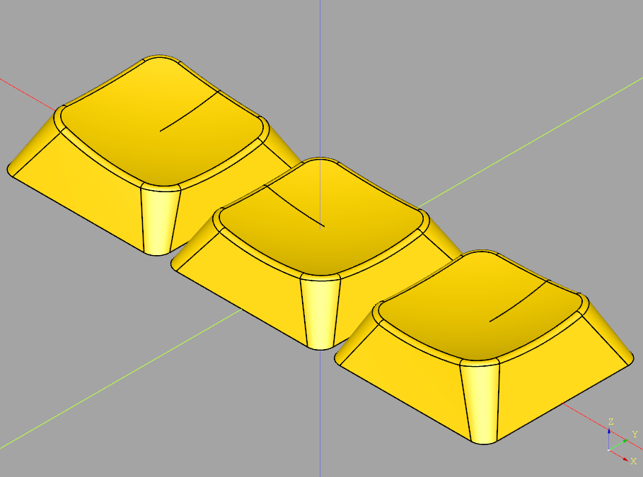
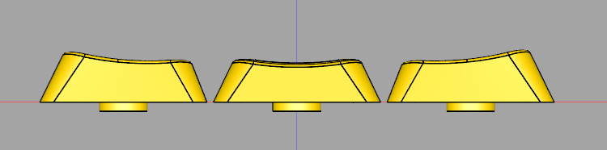

# OLS
The Open Low-Profile Spherical keycap profile.



## Variations
Each folder contains STL and STEP files of each key. The ones with `-cut` are intended and pre-oriented for FDM printing, and the ones without are suitable for resin.

### MX
Keycaps with MX-compatible stems. Designed for low-profile switches (e.g. Gateron KS-27, Gateron KS-33, NuPhy, Kailh Choc v2) but should work with full-sized switches as well.

### Choc Large
Keycaps with Choc stems but MX spacing.

### Choc Small
Keycaps with Choc stems for Choc spacing. You'll have gaps if you use them on an MX-spaced board.

### Sprue
Sprued assemblies ready for printing at JLCPCB or other services. JLCPCB has a limit of 10 objects per file so these are built accordingly.

## Printing
For FDM printing, these caps work best oriented at 90 degrees to the build plate. This gives them a strong stem (particularly for Choc stems, any other orientation is very fragile) and a good finger surface even without sanding. You should probably use the `-cut` versions of the files which are pre-oriented. These cut off a bit of the rear edge to give a small flat surface for build plate adhesion.

My settings:
|Setting|Value|Note|
|-------|-----|----|
|Layer height|0.12mm|Smaller layer heights don't improve the quality very much.|
|First layer height|0.2mm||
|Perimeters/Shells|3 or more||
|Infill|20%|Doesn't matter, since they are so thin almost the whole print will be perimeters.|
|Supports|On build plate only||
|Support Z gap|0.12mm||
|Support interface|100%||
|Seams|Aligned||
|Raft|Depends|I had good results with R3 and R4 keycaps using a raft, but the R2 caps kept failing. Printing the `-cut` version directly on the build plate worked better for those. Glue stick helps.|
|Avoid crossing perimeters|On||
|Z-hop|0.24mm|Only when printing a batch - for a single keycap you don't need it.|
|Z-hop starting at|1mm||

For resin, you'll most likely want to use an "ABS-like" resin to ensure the stems are strong.

## Developing
Install [Miniforge](https://github.com/conda-forge/miniforge/#download), Miniconda, or another implementation of `conda`. Cadquery is only available as a conda package and not through pip.

Create a conda environment with the required packages:

```sh
conda env create -f environment.yml
```

Use cq-editor to edit and view your changes interactively:

```sh
cq-editor
```

Or render STL and STEP files automatically:

```sh
python generate.py
```

## License

<a rel="license" href="http://creativecommons.org/licenses/by-sa/4.0/"></a><br />This work is licensed under a <a rel="license" href="http://creativecommons.org/licenses/by-sa/4.0/">Creative Commons Attribution-ShareAlike 4.0 International License</a>.

## Acknowledgements

This work was inspired by [LDSA](https://lowprokb.ca/products/ldsa-low-profile-blank-keycaps) and [OPK](https://github.com/cubiq/OPK) but is not directly based on either. Special thanks to the folks from fingerpunch Discord, who got me into the low-profile rabbit hole in the first place, and have given lots of helpful feedback along the way.
